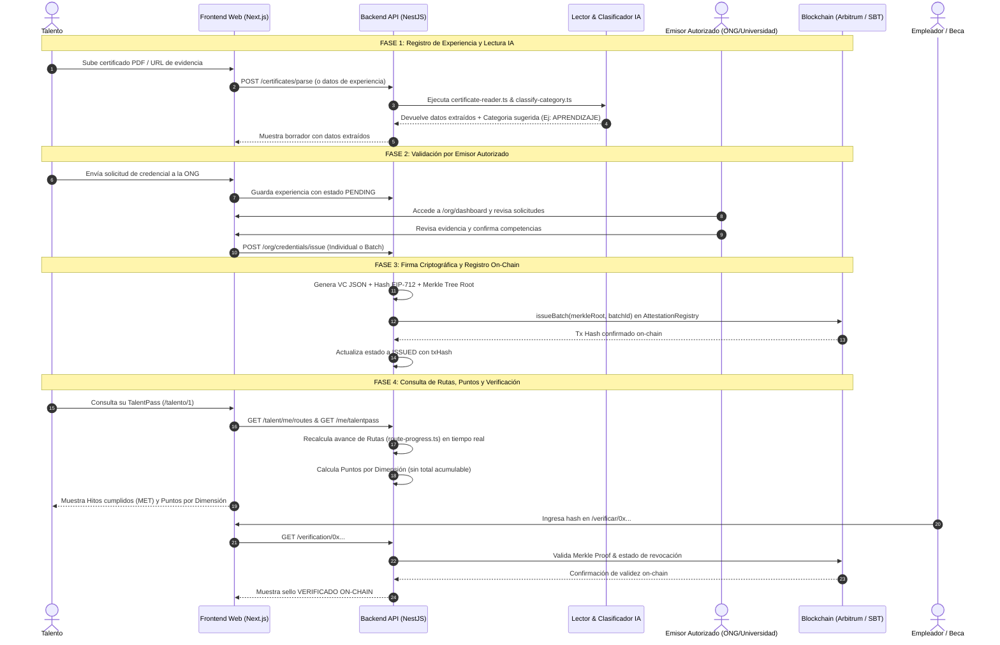

# 🗺️ Flujograma Completo del Sistema ProofPath

> **Documento Técnico de Procesos y Arquitectura**  
> *Diseñado para exportación a PDF, presentación a jurados y documentación oficial.*

---

## 📌 1. Visión General del Flujo Ecosistémico

El sistema **ProofPath** opera bajo el principio de **Emisor Responsable**: la evidencia técnica demuestra el origen e integridad de los datos, pero la credencial se emite únicamente cuando una organización autorizada la firma digitalmente (on-chain o mediante EIP-712).

```mermaid
flowchart TD
    classDef evidencia fill:#e0f2fe,stroke:#0284c7,stroke-width:2px,color:#0369a1
    classDef ia fill:#f3e8ff,stroke:#9333ea,stroke-width:2px,color:#6b21a8
    classDef emisor fill:#fef3c7,stroke:#d97706,stroke-width:2px,color:#92400e
    classDef crypto fill:#dcfce7,stroke:#16a34a,stroke-width:2px,color:#15803d
    classDef chain fill:#fee2e2,stroke:#dc2626,stroke-width:2px,color:#991b1b
    classDef consumo fill:#e0e7ff,stroke:#4f46e5,stroke-width:2px,color:#3730a3

    subgraph INGESTION ["1. Ingestión de Evidencia"]
        A1[Certificado PDF / Imagen] :::evidencia
        A2[Repositorio GitHub / Código] :::evidencia
        A3[Registro de Horas / Asistencia] :::evidencia
    end

    subgraph PROCESAMIENTO ["2. Lectura & Clasificación IA"]
        B1[certificate-reader.ts<br/>Extracción de Datos] :::ia
        B2[classify-category.ts<br/>Sugerencia de Categoría & Confianza] :::ia
    end

    subgraph VALIDACION ["3. Emisión & Validación"]
        C1[Panel ONG / Emisor Autorizado] :::emisor
        C2{¿Aprobado por Humano?} :::emisor
        C3[Rechazado / Descartado] :::emisor
    end

    subgraph CRIPTOGRAFIA ["4. Firma & Hash VC"]
        D1[Generación de VC JSON<br/>buildVc] :::crypto
        D2[Cálculo de Credential Hash & Merkle Leaf] :::crypto
        D3[Firma EIP-712 con Clave de Emisor] :::crypto
    end

    subgraph BLOCKCHAIN ["5. Registro On-Chain"]
        E1[AttestationRegistry.sol<br/>Arbitrum Sepolia / Stylus] :::chain
        E2[TalentPassSBT.sol<br/>Token Soulbound] :::chain
    end

    subgraph CONSUMO ["6. Rutas, Puntos & Verificación"]
        F1[Motor de Rutas route-progress.ts<br/>Evaluación Dinámica de Requisitos] :::consumo
        F2[Puntos por Dimensión points-by-dimension.ts<br/>6 Dimensiones Independientes] :::consumo
        F3[Portal de Verificación Pública /verificar/hash] :::consumo
    end

    A1 --> B1
    A2 --> B2
    A3 --> B2
    B1 --> B2
    B2 --> C1
    C1 --> C2
    C2 -- No --> C3
    C2 -- Sí --> D1
    D1 --> D2
    D2 --> D3
    D3 --> E1
    E1 --> E2
    E2 --> F1
    E2 --> F2
    E2 --> F3
```

---

## 🔄 2. Diagrama de Secuencia Detallado (End-to-End)



---

## 🧱 3. Desglose de Subsystems y Funcionalidades

### 📥 Subsistema 1: Ingestión de Evidencia
- **Tipos de Evidencia Aceptados:**
  - Documento / Certificado (PDF / Imagen).
  - Repositorio de Código (GitHub).
  - Demo Desplegada (URL).
  - Constancia de Horas / Asistencia (QR / DKIM).
- **Regla:** La evidencia no es la credencial. Demuestra el origen del dato antes de la firma.

---

### 🤖 Subsistema 2: Lectura y Clasificación IA (`apps/api/src/certificates`)
- **`certificate-reader.ts`**:
  - Parsea el texto del certificado mediante expresiones regulares y heurísticas de dominio.
  - Extrae: `holderName`, `issuerName`, `title`, `issuedOn`, `hours`, `verificationCode`, `verificationUrl`.
  - Establece `verificationLevel = 'SELF_REPORTED'` hasta la firma institucional.
- **`classify-category.ts`**:
  - Mapea el contenido contra la **taxonomía cerrada `ExperienceCategory`**:
    - `APRENDIZAJE` (Cursos, certificaciones)
    - `IMPACTO_AMBIENTAL` (Reforestación, reciclaje, agua)
    - `IMPACTO_SOCIAL` (Voluntariado, mentoría, comedores)
    - `INNOVACION_TECNOLOGIA` (Hackathons, repos, prototipos)
    - `LIDERAZGO_COMUNIDAD` (Organización de eventos, coordinaciones)
    - `TRAYECTORIA` (Prácticas, freelance, empleo formal)
  - Calcula puntaje de confianza (`0.0` a `1.0`) y devuelve los términos encontrados.

---

### 🏛️ Subsistema 3: Validación Institucional (`/org/dashboard`)
- **Roles:** Organizaciones registradas y verificadas (`isTrusted = true`).
- **Flujo:**
  1. Revisión nominal de solicitudes en el panel de la ONG.
  2. Aprobación de claims de habilidades (*skills* humanas y técnicas).
  3. Firma individual o en lote (*Batch Issuance*).

---

### 🔑 Subsistema 4: Criptografía y Estructura VC (`apps/api/src/credentials`)
- **VC Builder (`vc-builder.ts`)**: Construye la credencial conforme a estándares W3C en formato JSON.
- **Hash de Credencial (`credentialHash`)**: Hash keccak256 determinístico de los campos canónicos.
- **Merkle Tree (`buildMerkleTree`)**: Agrupa múltiples credenciales en una sola raíz para emisión masiva eficiente.
- **Firma EIP-712**: Estructura de firma legible por humanos en billeteras Ethereum / Arbitrum.

---

### ⛓️ Subsistema 5: Contratos Inteligentes On-Chain (`packages/contracts`)
- **`AttestationRegistry.sol`**:
  - Guarda la raíz de Merkle (`merkleRoot`) y el identificador de lote (`batchId`).
  - Registro de revocaciones auditables e inmutables.
- **`TalentPassSBT.sol`**:
  - Token Soulbound ERC-721 no transferible asociado a la wallet del talento.
- **Diferenciación Técnica con Stylus:**
  - Arbitrum Stylus permite verificación de Merkle proofs ejecutados en Wasm a costo de gas mínimo.

---

### 🎯 Subsistema 6: Rutas, Puntos y Verificación Pública

#### A. Motor de Rutas y Progreso (`route-progress.ts`)
- **Modelos:** `Route` y `RouteMilestone`.
- **Mecánica:** Los hitos de una convocatoria (ej. *Beca Semilla 2026*) se evalúan **en tiempo real** contra las credenciales del talento.
- **Estados de Hito:**
  - `MET` (Cumplido por credencial vigente).
  - `IN_REVIEW` (Experiencia enviada en revisión por la ONG).
  - `PENDING` (Pendiente por cumplir).
- **Garantía Ética:** **Sin persistencia de score**. El progreso se recomputa en cada request y no existe ranking global de personas.

#### B. Puntos por Dimensión (`points-by-dimension.ts`)
- Mide la participación validada en las 6 dimensiones.
- **Regla Implacable:** **Sin total general acumulado**. Cada oportunidad evalúa únicamente las dimensiones de su interés.

#### C. Portal de Verificación Pública (`/verificar/[hash]`)
- Auditoría independiente por hash o código QR.
- Muestra el emisor, nivel de verificación (`ON_CHAIN` / `ISSUER_VERIFIED`), vigencia y prueba criptográfica.

---

## 📄 Guía de Exportación a PDF

Para convertir este documento en un PDF de presentación:
1. Abre este archivo en VS Code o en un navegador web.
2. Utiliza la función **Imprimir** (`Ctrl + P` o `Cmd + P`).
3. Selecciona **Guardar como PDF**.
4. Asegúrate de marcar la opción **Gráficos de fondo / Background graphics**.

---
*ProofPath — Verificamos experiencias atribuidas a emisores responsables.*
